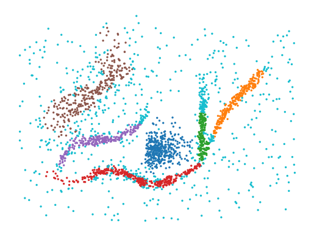

[](https://badge.fury.io/py/fast_hbcc)
[](https://github.com/vda-lab/fast_hbcc/actions/workflows/Tests.yml)


Hierarchical Boundary Coefficient Clustering
============================================

HBCC is a clustering algorithm is inspired by the work of Peng et al. [4]. Their
CDC algorithm detects regions that separate clusters by quantifying how spread
out points' neighbors are in feature space. The intuition for this process is as
follows: (1) points within a clusters have near neighbors on all sides, and (2)
points in-between clusters or on the edge of a cluster predominantly have
neighbors in the direction of the cluster's core.

The same intuition was previously used by Vandaele et al. [2] to quantify how
close points are to the boundary of the data's manifold. They used their
`boundary coefficient` to extract manifold skeletons.

HBCC combines Vandaele et al. [2]'s boundary coefficient with HDBSCAN's [1], [3]
principled density-based cluster selection strategies. This approach removes
CDC's `ratio` parameter. Instead a clustering hierarchy is evaluated over all
 `boundary coefficient` values and clusters are selected from the hierarchy.

The implementation relies on McInnes'
[fast_hdbscan](https://github.com/TutteInstitute/fast_hdbscan) and its support
for lensed clustering introduced for Bot et al. [5] to detect branches.

The HBCC algorithm works as follows:

1. Compute k nearest neighbors and minimum spanning tree [3].
2. Compute n-hop distances from nearest neighbors [2]
3. Compute the boundary coefficient for each point [2].
4. Compute minimum spanning tree from boundary coefficient weighted knn--mst
   graph union [5].
5. Compute HDBSCAN cluster hierarchy and selection [1].

References:
  - [1] Campello, R. J., Moulavi, D., & Sander, J. (2013, April). Density-based
    clustering based on hierarchical density estimates. In Pacific-Asia
    Conference on Knowledge Discovery and Data Mining (pp. 160-172). Springer
    Berlin Heidelberg.

  - [2] Vandaele, R., Saeys, Y., & De Bie, T. (2019). The Boundary Coefficient :
    a Vertex Measure for Visualizing and Finding Structure in Weighted Graphs.
    15th International Workshop on Mining and Learning with Graphs (MLG).

  - [3] McInnes, L., & Healy, J. (2017). Accelerated Hierarchical Density Based
    Clustering. 2017 IEEE International Conference on Data Mining Workshops
    (ICDMW), 2017-Novem, 33–42. https://doi.org/10.1109/ICDMW.2017.12.

  - [4] Peng, D., Gui, Z., Wang, D., Ma, Y., Huang, Z., Zhou, Y., & Wu, H.
    (2022). Clustering by measuring local direction centrality for data with
    heterogeneous density and weak connectivity. Nature Communications, 13(1),
    1–14. https://doi.org/10.1038/s41467-022-33136-9.

  - [5] Bot, Daniël M., et al. "FLASC: A Flare-Sensitive Clustering Algorithm:
    Extending HDBSCAN* for Detecting Branches in Clusters." arXiv preprint
    arXiv:2311.15887 (2023). https://arxiv.org/abs/2311.15887.


How to use HBCC
---------------

```python
import numpy as np
import matplotlib.pyplot as plt
from fast_hbcc import HBCC

data = np.load('data/flareable/flared_clusterable_data.npy')
c = HBCC(
    num_hops=4,
    min_samples=10,
    min_cluster_size=100,
    cluster_selection_method="leaf",
).fit(data)
plt.scatter(*data.T, c=c.labels_ % 10, s=2, cmap='tab10', vmin=0, vmax=9)
plt.axis("off")
plt.show()
```



## Example Notebooks

A notebook demonstrating how the algorithm works is available on
[nbviewer](https://nbviewer.org/github/vda-lab/fast_hbcc/blob/master/notebooks/HBCC.ipynb).


## Citing

Citing information not available yet.


## Licensing

The fast_hbcc package has a 2-Clause BSD license. 