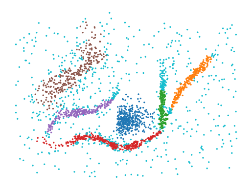

.. fast_hbcc documentation master file.

Hierarchical Boundary Coefficient Clustering
============================================

HBCC is a clustering algorithm is inspired by the work of Peng et al.
[4]_. Their CDC algorithm detects regions that separate clusters by
quantifying how spread out points' neighbors are in feature space. The
intuition for this process is as follows: (1) points within a clusters
have near neighbors on all sides, and (2) points in-between clusters or
on the edge of a cluster predominantly have neighbors in the direction
of the cluster's core.

The same intuition was previously used by Vandaele et al. [2]_ to
quantify how close points are to the boundary of the data's manifold.
They used their ``boundary coefficient`` to extract manifold skeletons.

HBCC combines Vandaele et al. [2]_'s boundary coefficient with HDBSCAN's
[1]_, [3]_ principled density-based cluster selection strategies. This
approach removes CDC's ``ratio`` parameter. Instead a clustering
hierarchy is evaluated over all ``boundary coefficient`` values and
clusters are selected from the hierarchy.

The implementation relies on McInnes'
`fast_hdbscan <https://github.com/TutteInstitute/fast_hdbscan>`__ and
its support for lensed clustering introduced for Bot et al. [5]_ to
detect branches.

The HBCC algorithm works as follows:

1. Compute k nearest neighbors and minimum spanning tree [3]_.
2. Compute n-hop distances from nearest neighbors [2]_.
3. Compute the boundary coefficient for each point [2]_.
4. Compute minimum spanning tree from boundary coefficient weighted
   knn--mst graph union [5]_.
5. Compute HDBSCAN cluster hierarchy and selection [1]_.

How to use HBCC
---------------

.. code:: python

   import numpy as np
   import matplotlib.pyplot as plt
   from fast_hbcc import HBCC

   data = np.load('data/flareable/flared_clusterable_data.npy')
   c = HBCC(
       num_hops=4,
       min_samples=10,
       min_cluster_size=100,
       cluster_selection_method="leaf",
   ).fit(data)
   plt.scatter(*data.T, c=c.labels_ % 10, s=2, cmap='tab10', vmin=0, vmax=9)
   plt.axis("off")
   plt.show()

Contents
--------

.. toctree::
   :maxdepth: 2

   examples
   reference

Citing
------

Citing information not available yet.

Licensing
---------

The fast_hbcc package has a 2-Clause BSD license.

References
----------

.. [1] Campello, R. J., Moulavi, D., & Sander, J. (2013, April).
   Density-based clustering based on hierarchical density estimates. In
   Pacific-Asia Conference on Knowledge Discovery and Data Mining (pp.
   160-172). Springer Berlin Heidelberg.

.. [2] Vandaele, R., Saeys, Y., & De Bie, T. (2019). The Boundary
   Coefficient : a Vertex Measure for Visualizing and Finding Structure
   in Weighted Graphs. 15th International Workshop on Mining and
   Learning with Graphs (MLG).

.. [3] McInnes, L., & Healy, J. (2017). Accelerated Hierarchical Density
   Based Clustering. 2017 IEEE International Conference on Data Mining
   Workshops (ICDMW), 2017-Novem, 33–42.
   https://doi.org/10.1109/ICDMW.2017.12.

.. [4] Peng, D., Gui, Z., Wang, D., Ma, Y., Huang, Z., Zhou, Y., & Wu,
   H. (2022). Clustering by measuring local direction centrality for
   data with heterogeneous density and weak connectivity. Nature
   Communications, 13(1), 1–14.
   https://doi.org/10.1038/s41467-022-33136-9.

.. [5] Bot, Daniël M., et al. "FLASC: A Flare-Sensitive Clustering
   Algorithm: Extending HDBSCAN\* for Detecting Branches in Clusters."
   arXiv preprint arXiv:2311.15887 (2023).
   https://arxiv.org/abs/2311.15887.
